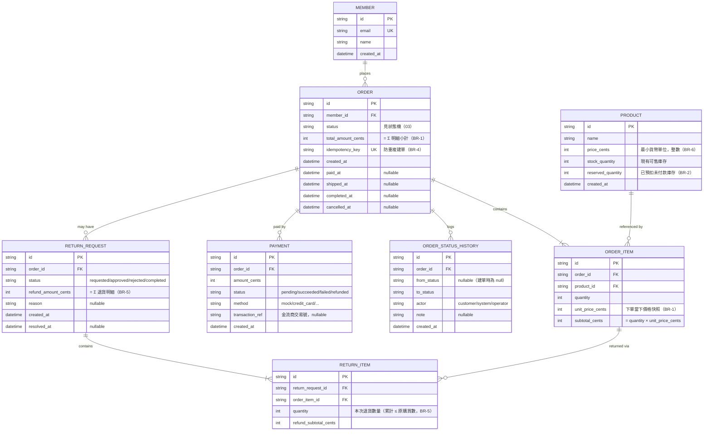

# 02. ER Diagram：訂單流程資料模型

> 上游：`01-requirements.md`（實體由 User Story 與 Business Rules 推導）
> 下游：`03-state-machine.md`（狀態欄位）、`04-api-spec.md`（response schema）、`poc/prisma/schema.prisma`（實作）

---

## 1. 實體關係圖

## 2. 實體說明與設計理由

### MEMBER（會員）
下單者。本專案只用到最小欄位；認證、地址簿等不在範圍。`email` 設唯一鍵。

### PRODUCT（商品）
關鍵在**庫存兩階段**（BR-2）：`stock_quantity` 是可售庫存，`reserved_quantity` 是已下單未付款的預扣量。可承接的新訂單量 = `stock_quantity`。下單時 `stock_quantity--, reserved_quantity++`；付款成功時 `reserved_quantity--`（正式扣減落定）；取消/逾時時 `stock_quantity++, reserved_quantity--`（釋放）。

> 為什麼不用單一欄位相減：分開存才能區分「真的賣掉」與「暫時鎖住」，對帳與庫存報表都需要這個區分。

### ORDER（訂單）
訂單主檔。`status` 是狀態機（文件 03）的當前狀態，多個時間戳欄位（`paid_at`/`shipped_at`/...）記錄各階段發生時間，`nullable` 表示尚未到達該階段。`idempotency_key` 唯一，實現 BR-4 防重複建單。`total_amount_cents` 是明細小計加總的**冗餘欄位**——刻意反正規化，避免每次讀訂單都要重算，代價是建單時要確保與明細一致（在同一交易內寫入）。

### ORDER_ITEM（訂單明細）
訂單與商品的多對多拆解。核心是 `unit_price_cents` **價格快照**（BR-1）：複製下單當下的商品價格，與 `PRODUCT.price_cents` 脫鉤，確保日後改價不影響歷史訂單。

### PAYMENT（付款）
一張訂單可有多筆付款紀錄（失敗重試、退款各留痕），故 `ORDER ||--o{ PAYMENT`。`status` 涵蓋 `pending/succeeded/failed/refunded`。真實金流的成功與否由 webhook 回填 `transaction_ref`。

### RETURN_REQUEST / RETURN_ITEM（退貨單／退貨明細）
支援**部分退貨**（US-05）的關鍵設計：一張退貨單（`RETURN_REQUEST`）掛多筆退貨明細（`RETURN_ITEM`），每筆指向一個 `ORDER_ITEM` 並記錄本次退貨數量。BR-5 的「累計退貨不超過原數量」＝ 對同一 `order_item_id` 的所有 `RETURN_ITEM.quantity` 加總 ≤ `ORDER_ITEM.quantity`。

### ORDER_STATUS_HISTORY（狀態異動紀錄）
NFR 可觀測性的落地：每次狀態轉移插一筆，記錄 `from → to`、觸發者（`actor`）、時間。可完整回放一張訂單的生命週期，也是客訴與帳務爭議的稽核依據。

## 3. 關鍵關聯基數（Cardinality）

| 關聯 | 基數 | 理由 |
|------|------|------|
| MEMBER → ORDER | 1 對多 | 一個會員多張訂單 |
| ORDER → ORDER_ITEM | 1 對多（至少 1） | 訂單必含至少一個品項，用 `\|{`（one-or-more） |
| PRODUCT → ORDER_ITEM | 1 對多 | 一個商品出現在多張訂單的明細中 |
| ORDER → PAYMENT | 1 對多 | 允許失敗重試、退款多筆紀錄 |
| ORDER → RETURN_REQUEST | 1 對多 | 部分退貨可分多次申請 |
| RETURN_REQUEST → RETURN_ITEM | 1 對多（至少 1） | 一張退貨單至少退一個品項 |
| ORDER_ITEM → RETURN_ITEM | 1 對多 | 同一品項可分多次部分退貨 |

## 4. 對一致性鏈的承諾

- `ORDER.status` 的合法值 **完全由** `03-state-machine.md` 定義
- 金額欄位一律 `int ..._cents`（BR-6），下游 Prisma schema 用 `Int`，API response 明確標注單位為「分」
- 下游 `04-api-spec.md` 的 response body 欄位，必須是本文件實體欄位的子集或衍生
