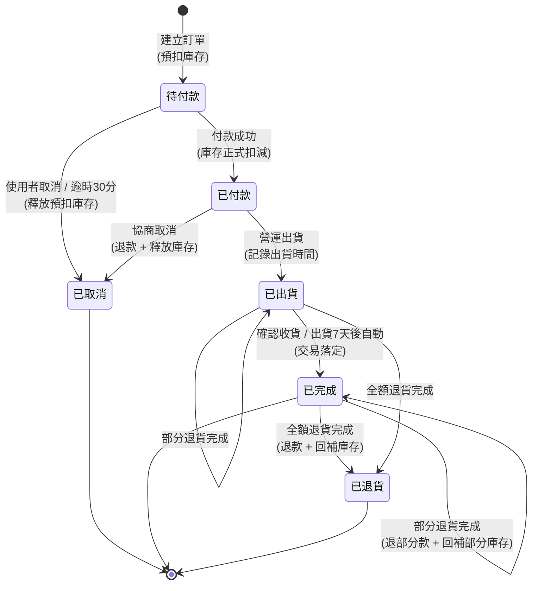

# 03. State Machine：訂單狀態機

> 上游：`01-requirements.md`（狀態與轉移由 User Story／AC／Business Rules 推導）、`02-er-diagram.md`（`ORDER.status`）
> 下游：`04-api-spec.md`（每支端點對應一次轉移）、`poc/`（轉移守衛與 side effect）

---

## 1. 狀態圖

## 2. 狀態定義

| 狀態 | 英文 | 說明 | 是否終態 |
|------|------|------|:------:|
| 待付款 | `PENDING_PAYMENT` | 訂單成立、庫存已預扣，等待付款 | 否 |
| 已付款 | `PAID` | 付款成功、庫存正式扣減，等待出貨 | 否 |
| 已出貨 | `SHIPPED` | 商品已出貨，等待收貨 | 否 |
| 已完成 | `COMPLETED` | 交易完成（可再申請退貨） | 半終態* |
| 已取消 | `CANCELLED` | 訂單取消（付款前或協商退款後） | 是 |
| 已退貨 | `RETURNED` | 全部品項退貨完成 | 是 |

> *「已完成」為半終態：正常流程不再前進，但仍可觸發退貨。部分退貨後仍停留在「已完成」（見 §4）。

## 3. 轉移表（含守衛條件與副作用）

轉移表是本文件的核心，也是 API 與 PoC 實作的直接依據。**守衛（Guard）** 是轉移的前置條件，不滿足則拒絕；**副作用（Side Effect）** 必須與狀態變更在同一交易內完成。

| # | From | To | 觸發事件 | 守衛條件 | 副作用 | 對應 AC |
|---|------|----|---------|---------|--------|---------|
| T1 | （無） | 待付款 | 建立訂單 | 所有品項庫存足夠；idempotency key 未用過 | 預扣庫存、寫明細與價格快照、寫 history | US-01 AC-1/3/4 |
| T2 | 待付款 | 已付款 | 付款成功 | 訂單為待付款 | 預扣轉正式扣減、寫 payment(succeeded)、寫 history | US-02 AC-1/2 |
| T3 | 待付款 | 已取消 | 使用者取消 | 訂單為待付款 | 釋放預扣庫存、寫 history | US-04 AC-1 |
| T4 | 待付款 | 已取消 | 逾時 30 分 | 建單逾 30 分未付款 | 釋放預扣庫存、寫 history(actor=system) | US-02 AC-4 / BR-3 |
| T5 | 已付款 | 已出貨 | 營運出貨 | 訂單為已付款 | 記錄 shipped_at、寫 history(actor=operator) | US-03 AC-1 |
| T6 | 已付款 | 已取消 | 協商取消 | 訂單為已付款且未出貨 | 退款、回補庫存、寫 payment(refunded)、寫 history | US-04 AC-2 |
| T7 | 已出貨 | 已完成 | 確認收貨 / 逾 7 天 | 訂單為已出貨 | 記錄 completed_at、寫 history | US-03 AC-2 |
| T8 | 已完成/已出貨 | 已退貨 | 全額退貨完成 | 退貨審核通過且涵蓋所有剩餘品項 | 退款、回補庫存、寫 history | US-05 AC-3/4 |
| T9 | 已完成/已出貨 | （原狀態） | 部分退貨完成 | 退貨審核通過且未涵蓋全部品項；累計 ≤ 原數量 | 退部分款、回補部分庫存、寫 return 明細與 history | US-05 AC-2/4/5 / BR-5 |

## 4. 邊界情況與設計決策

### 4.1 付款逾時（T4）
逾時取消由**系統**觸發，非使用者操作。實作上有兩種選擇：

- **排程掃描**（PoC 採用）：定時任務掃 `待付款且 created_at < now-30min` 的訂單批次取消。簡單、可測，適合 PoC。
- **延遲佇列**：建單時推一個 30 分後到期的訊息。即時但需額外基礎設施。

PoC 用排程掃描，並在 spec 標注生產環境可換延遲佇列——這是「先簡單可跑，再演進」的刻意取捨。

### 4.2 部分退貨為什麼是「自迴圈」（T9）
部分退貨不改變主狀態（停留在已完成/已出貨），因為訂單整體交易仍成立，只是局部退款。退貨的進度記錄在 `RETURN_REQUEST`/`RETURN_ITEM`，不污染訂單主狀態。只有當**所有剩餘品項都退完**，才轉「已退貨」（T8）。

> 這是常見的設計陷阱：若把「部分退貨」也設成一個訂單主狀態，狀態機會爆炸（每種退貨組合一個狀態）。用「主狀態不變＋子實體記錄退貨」解耦，是讓狀態機保持可控的關鍵。

### 4.3 併發下單與超賣（T1）
兩個請求同時搶最後一件庫存，必須靠 `T1` 的守衛在**交易內**檢查並預扣（`SELECT ... FOR UPDATE` 或樂觀鎖）。PoC 用資料庫交易 + 條件更新（`UPDATE ... WHERE stock_quantity >= qty`）確保不超賣，並在 spec 說明。

### 4.4 非法轉移一律拒絕
任何未在轉移表列出的轉移（例如「已完成 → 待付款」、「已取消 → 已付款」）都是非法操作，API 回傳 **409 Conflict**。這條規則讓狀態機成為**唯一的轉移真相**——程式不允許繞過它改 `status`。

## 5. 對一致性鏈的承諾

- 本文件的 6 個狀態值 = `02-er-diagram.md` 的 `ORDER.status` 合法值 = PoC 的 enum
- 每支會改變訂單狀態的 API（`04-api-spec.md`）必須標注它對應哪個轉移編號（T1–T9）
- 每次轉移都寫一筆 `ORDER_STATUS_HISTORY`（NFR 可觀測性）
